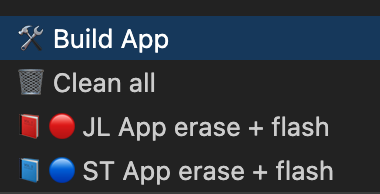

# stm32_guitar_tuner
Hello! Here you see my bachelor's project - guitar tuner based on STM32.
It contains circuit and PCB design, FW development and mechanical design.

Used in this project:

- Altium Designer 18;
- STM32F042K6T7;
- C + CMSIS + LL;
- Make.

## Links:

[Circuit/PCB design](https://github.com/nktsb/stm32_guitar_tuner/tree/main/PCB%2C%20Schematic%2C%20etc)

[STM32 project (VSCode)](./stm32_project)

## Build:

To build and flash STM32 project, open project in VSCode and open tasks menu with hotkeys:

***Windows/Linux:***

<kbd>Ctrl</kbd>+<kbd>Shift</kbd>+<kbd>B</kbd>

***MacOS:***

<kbd>Cmd</kbd>+<kbd>Shift</kbd>+<kbd>B</kbd>

### Menu:

*JL - JLink*

*ST - STLink*

## Demo:

